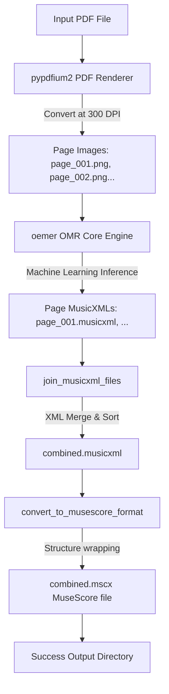

# PDF2Muse 🎶

[](https://www.python.org/)
[](https://opensource.org/licenses/MIT)
[](https://github.com/psf/black)
[](https://github.com/astral-sh/ruff)

Convert printed sheet music PDFs into digital, editable **MusicXML** 🎼 and **MuseScore (.mscx)** files using advanced Optical Music Recognition (OMR).

PDF2Muse bridges the gap between static paper/digital scores and interactive music software. Under the hood, it leverages the powerful [oemer](https://github.com/BreezeWhite/oemer) machine learning OMR library to transcribe music with high precision.

---

## 📖 Table of Contents
* [💡 What is PDF2Muse? (Simple Intro)](#-what-is-pdf2muse-simple-intro)
* [🚀 Quick Start](#-quick-start)
* [📦 Installation Guide](#-installation-guide)
* [🛠️ How to Use](#️-how-to-use)
  * [Option A: Command Line Interface (CLI)](#option-a-command-line-interface-cli)
  * [Option B: Interactive Web Interface (Web UI)](#option-b-interactive-web-interface-web-ui)
* [🐍 Python API Reference (For Developers & LLMs)](#-python-api-reference-for-developers--llms)
* [🧩 System Architecture & Data Flow](#-system-architecture--data-flow)
  * [Codebase Structure](#codebase-structure)
  * [Under the Hood: Data Pipeline](#under-the-hood-data-pipeline)
  * [Model Management](#model-management)
* [🎯 Tips for Best Results](#-tips-for-best-results)
* [🐛 Troubleshooting & FAQ](#-troubleshooting--faq)
* [🙏 Acknowledgements](#-acknowledgements)
* [📜 License](#-license)

---

## 💡 What is PDF2Muse? (Simple Intro)

Have you ever had a PDF of sheet music and wished you could edit the notes, transpose the key, hear it play back, or print it out with your own changes? 

Normally, you would have to manually re-type every single note into music notation software—a tedious process that can take hours or days. 

**PDF2Muse** does this work for you! It uses Artificial Intelligence to "read" your PDF sheet music and translate it into a digital format that standard music software can understand. 

### What You Get:
1. **MusicXML (`.musicxml`)**: The universal format for sheet music, compatible with almost all music software (MuseScore, Finale, Sibelius, Dorico, etc.).
2. **MuseScore (`.mscx`)**: A native file format for **[MuseScore](https://musescore.org/)**, the world's most popular free and open-source sheet music editor.

> [!NOTE]
> **Zero Complex Setup:** Unlike older OMR software, PDF2Muse does *not* require you to install external system tools like Poppler or Java to perform the conversion. It is fully self-contained!

---

## 🚀 Quick Start

Get up and running in less than two minutes:

1. **Install PDF2Muse with Web UI support:**
   ```bash
   pip install -U "pdf2muse[ui]"
   ```

2. **Launch the interactive Web App:**
   ```bash
   pdf2muse ui
   ```
   *This opens a friendly page in your web browser where you can simply drag-and-drop your PDFs and download your editable music files!*

---

## 📦 Installation Guide

PDF2Muse supports **Windows**, **macOS**, and **Linux** environments running **Python 3.9 or higher**.

Choose the installation option that best fits your workflow:

### 1. Standard Install (Command Line Only)
Ideal if you only plan to use the terminal or want a lightweight installation:
```bash
pip install pdf2muse
```

### 2. Full Install (With Interactive Web Interface)
Recommended for most users. Installs the Gradio web UI and its dependencies:
```bash
pip install "pdf2muse[ui]"
```

### 3. Developer & Contributor Install
If you plan to modify PDF2Muse, run tests, or format the codebase:
```bash
git clone https://github.com/thedivergentai/PDF2Muse.git
cd PDF2Muse
pip install -e ".[dev,ui]"
```

---

## 🛠️ How to Use

PDF2Muse gives you two ways to interact with the conversion pipeline: a command-line interface (CLI) and a web interface (Web UI).

### Option A: Command Line Interface (CLI)

Use simple terminal commands to batch-convert or automate your sheet music transcriptions.

#### Convert a PDF File
To convert a PDF with the default settings (saves results in an `output/` folder):
```bash
pdf2muse convert path/to/sheet_music.pdf
```

#### CLI Reference & Options

| Command / Option | Description | Example |
| :--- | :--- | :--- |
| `pdf2muse convert <file>` | Primary command to run the OMR conversion pipeline on a PDF. | `pdf2muse convert sonata.pdf` |
| `-o`, `--output <dir>` | Specify a custom directory to save your output files (defaults to `output`). | `pdf2muse convert sonata.pdf -o ./my_scores` |
| `--no-deskew` | Disable automatic page straightening. (Keep enabled unless scans are already perfectly aligned). | `pdf2muse convert sonata.pdf --no-deskew` |
| `--use-tf` | Use TensorFlow for OMR instead of the default ONNX Runtime engine. | `pdf2muse convert sonata.pdf --use-tf` |
| `--save-cache` | Save OMR model predictions to a cache for faster re-processing. | `pdf2muse convert sonata.pdf --save-cache` |
| `--verbose` | Enable deep, detailed debug logs in the terminal. | `pdf2muse convert sonata.pdf --verbose` |
| `--help` | Show detailed help instructions for any command. | `pdf2muse convert --help` |

---

### Option B: Interactive Web Interface (Web UI)

If you prefer a visual interface, you can run PDF2Muse as a local web application.

```bash
pdf2muse ui
```

* **Custom Port:** To run the web server on a specific port (e.g., 8080):
  ```bash
  pdf2muse ui --port 8080
  ```
* **Shareable Link:** Create a secure, public link to share your web app with others or use it from a mobile device:
  ```bash
  pdf2muse ui --share
  ```

---

## 🐍 Python API Reference (For Developers & LLMs)

If you are building custom applications, writing scripts, or using an LLM to integrate PDF2Muse, you can interact with the transcription pipeline programmatically.

### The `PDF2MusePipeline` Class

The core conversion routine is managed by the `PDF2MusePipeline` class located in `pdf2muse.core`.

```python
from pathlib import Path
from pdf2muse.core import PDF2MusePipeline

# 1. Initialize the conversion pipeline
pipeline = PDF2MusePipeline(
    pdf_path="piano_sonata.pdf",       # Path to input PDF file (absolute or relative)
    output_dir="my_transcriptions",    # Directory where resulting MusicXML/MSCX will be written
    deskew=True,                       # Auto-straighten pages (highly recommended)
    use_tf=False,                      # Use ONNX Runtime for faster machine learning inference
    save_cache=False                   # Set to True to cache intermediate OMR predictions
)

# 2. Run the pipeline
# This will automatically download necessary machine learning models on the first run.
# Returns: Path object pointing to the created MuseScore (.mscx) file.
try:
    mscx_file: Path = pipeline.run()
    print(f"🎉 Success! MuseScore file generated at: {mscx_file}")
except RuntimeError as e:
    print(f"❌ Conversion failed: {e}")
```

### Advanced Programmatic Helpers

You can also use lower-level functions directly from the package:

```python
from pathlib import Path
from pdf2muse.musicxml import join_musicxml_files, convert_to_musescore_format
from pdf2muse.oemer_utils import download_checkpoints, ensure_checkpoints

# Force pre-download or update model checkpoints
download_checkpoints(force=False)

# Check if model checkpoints are already downloaded locally
ensure_checkpoints()

# Manually combine a directory of individual page MusicXML files into one multi-page score
join_musicxml_files(
    input_dir=Path("./temp_pages"), 
    output_file=Path("./output/combined.musicxml")
)

# Convert a combined MusicXML file to a MuseScore (.mscx) format wrapper
convert_to_musescore_format(
    input_file=Path("./output/combined.musicxml"), 
    output_file=Path("./output/combined.mscx")
)
```

---

## 🧩 System Architecture & Data Flow

### Codebase Structure

Understanding the layout of the `pdf2muse` package:

```
PDF2Muse/
├── src/
│   └── pdf2muse/
│       ├── __init__.py       # Package entry points & version info
│       ├── cli.py            # Typer CLI application definitions
│       ├── core.py           # Main orchestration pipeline (PDF2MusePipeline)
│       ├── oemer_utils.py    # OMR model downloader and checkpoint handlers
│       ├── musicxml.py       # XML structural parsers to join and wrap music scores
│       └── ui.py             # Gradio-based interactive Web UI
├── tests/                    # Unit and integration test suites
├── pyproject.toml            # Modern project packaging configuration & metadata
├── README.md                 # System overview and user documentation
└── .gitignore
```

---

### Under the Hood: Data Pipeline

Below is the step-by-step processing workflow executed when a conversion request is initiated:



1. **PDF to Images:** `pypdfium2` reads the PDF and converts each page to a high-resolution PNG image (rendered at exactly 300 DPI, the optimal resolution for Optical Music Recognition).
2. **OMR Processing:** The engine runs `oemer` on each page image to extract musical symbols, durations, staves, and notes.
3. **MusicXML Consolidation:** Individual XML files representing each page are programmatically merged into a single multi-page `combined.musicxml` document, preserving measure order and parts.
4. **MuseScore Packaging:** The unified MusicXML score is wrapped in a native MuseScore XML schema format (`combined.mscx`) for instant compatibility with MuseScore.

---

### Model Management

PDF2Muse utilizes two pre-trained deep learning models under the hood:
* **`unet_big`** (1st stage): Performs layout analysis and staff-line extraction.
* **`seg_net`** (2nd stage): Detects musical symbols, notes, clefs, and accidentals.

These models are distributed as optimized **ONNX** files (`1st_model.onnx`, `2nd_model.onnx`). 

**Where are models saved?**
PDF2Muse downloads the checkpoints automatically on first run and stores them in your Python installation's `site-packages/oemer/checkpoints/` directory. This keeps your working workspace clutter-free.

---

## 🎯 Tips for Best Results

Optical Music Recognition is an intricate task. For the absolute best conversion accuracy, ensure your sheet music fits the following guidelines:

* **High Resolution:** Scans should be clear and high-resolution (300 DPI or higher). Dark, blurry, or low-contrast PDFs will result in missing notes.
* **Standard Notation:** PDF2Muse excels at standard Western classical music notation. Custom jazz charts, handwritten manuscripts, tab notation, or avant-garde visual scores will not transcribe accurately.
* **No Manual Markups:** Pencil markings, highlights, annotations, or severe creases on the original scan can confuse the AI model.
* **Aligned Scans:** Ensure the sheet music pages are straight. If they are slightly rotated, ensure that `--deskew` (straightening) is turned on (it is on by default).

---

## 🐛 Troubleshooting & FAQ

#### Q: How accurate is the conversion? Do I need to review it?
**A:** Just like Optical Character Recognition (OCR) for text, OMR is rarely 100% perfect. PDF2Muse will transcribe the vast majority of notes, staves, and clefs correctly, saving you hours of manual transcription. However, we highly recommend opening the final `.mscx` file in **MuseScore** to quickly review, clean up, and polish any misplaced notes or timings.

#### Q: "Gradio is not installed" Error when running Web UI
**A:** You likely installed the basic version of PDF2Muse. Simply install the UI dependencies by running:
```bash
pip install "pdf2muse[ui]"
```

#### Q: "Command not found: pdf2muse"
**A:** This occurs if your Python installation's `Scripts` directory is not added to your system's PATH. You can solve this in two ways:
1. Add the Python scripts directory to your system environment PATH.
2. Or, run the tool directly using Python's module launcher:
   ```bash
   python -m pdf2muse.cli convert sheet_music.pdf
   ```

#### Q: The conversion is running very slowly
**A:** By default, PDF2Muse uses CPU-based ONNX Runtime which is fast and lightweight. If you have a compatible TensorFlow CUDA GPU environment, you can experiment with the `--use-tf` flag to run model inference using TensorFlow.

---

## 🙏 Acknowledgements

This project is built upon the phenomenal work of the **[oemer](https://github.com/BreezeWhite/oemer)** project. We extend our sincere gratitude to the oemer team and contributors for creating and sharing their state-of-the-art optical music recognition framework.

---

## 📜 License

PDF2Muse is open-source software licensed under the **[MIT License](LICENSE)**. Feel free to copy, modify, and distribute it as needed!

---
*Created and maintained with ❤️ by [TheDivergentAI](https://github.com/thedivergentai)*
