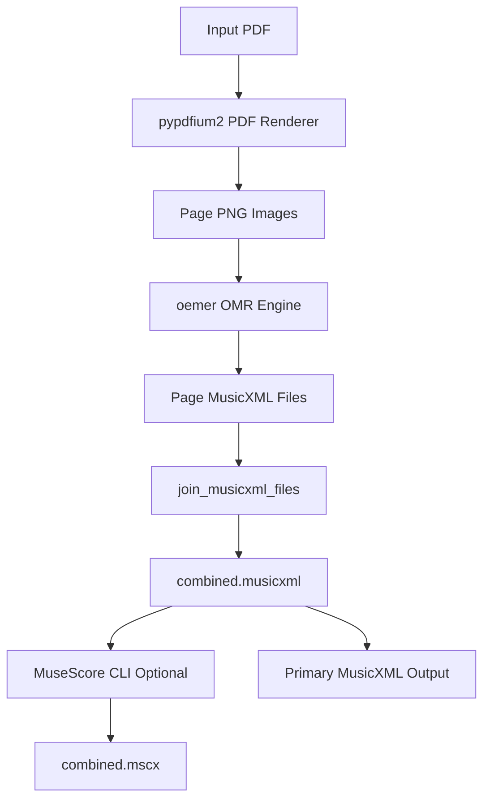

# PDF2Muse

<div align="center">

[](https://www.python.org/)
[](https://opensource.org/licenses/MIT)
[](https://github.com/psf/black)
[](https://github.com/astral-sh/ruff)

Convert sheet music PDFs into MusicXML, with optional MuseScore export, using open-source Optical Music Recognition.

**Maintained by [Divergent AI](https://github.com/thedivergentai)**

</div>

---

## Project Status

PDF2Muse is an early revived project. It can render PDF pages, run the open-source [`oemer`](https://github.com/BreezeWhite/oemer) OMR engine, combine generated MusicXML pages, and optionally export a MuseScore `.mscx` file when the MuseScore CLI is available.

It is not yet quality-proven. The current pipeline may produce weak or malformed notation, even for clean PDFs, and every generated score should be reviewed in notation software before use in performance, teaching, publication, or archival work.

The next phase of development is about measurement first: building repeatable evaluation tools, comparing output against ground-truth MusicXML/MEI datasets, and using those results to decide whether synthetic degradation or fine-tuning work is justified.

---

## A Note From Divergent AI

PDF2Muse has seen enough interest that it is worth picking up again with a more honest, evidence-driven approach.

The original idea still matters: many musicians, composers, teachers, archivists, and hobbyists have PDFs or scanned scores that they would rather edit, transpose, search, and preserve as structured notation. The project is not there yet. In its current state, it is useful for experimentation and development, but not something I want to present as a polished or reliably useful product.

I am bringing the project back with a stronger focus on evaluation, quality thresholds, and practical ML workflows. The immediate goal is to find or assemble datasets that pair score images or PDFs with trusted symbolic notation, run PDF2Muse against them, and let the results guide the work instead of relying on vague accuracy claims.

If the project can be made genuinely useful, I want it to serve the community of passionate music lovers, composers, and open-source builders who care about making notation more accessible.

-- Divergent AI

---

## Quick Navigation

| Start | Use | Evaluate | Understand | Contribute |
|:---:|:---:|:---:|:---:|:---:|
| [Quick Start](#quick-start) | [How To Use](#how-to-use) | [Quality Roadmap](#quality-roadmap) | [Architecture](#architecture) | [Development](#development) |

---

## What PDF2Muse Does

PDF2Muse is a Python tool for converting sheet music PDFs into editable notation formats:

1. It renders PDF pages into high-resolution page images with `pypdfium2`.
2. It runs `oemer` on each page image to generate page-level MusicXML.
3. It combines generated page MusicXML files into `combined.musicxml`.
4. It optionally calls the MuseScore CLI to export `combined.mscx`.

MusicXML is the primary output. MuseScore `.mscx` export is a convenience layer and depends on MuseScore being installed or passed with `--musescore-path`.

## What To Expect

PDF2Muse is most likely to behave reasonably on clean, standard Western staff notation. It is more likely to fail on handwritten manuscripts, low-contrast scans, skewed or cropped pages, complex layouts, heavy annotations, tablature, and unusual contemporary notation.

The current project does not publish measured accuracy numbers yet. Until evaluation reports exist, treat every conversion as a draft that needs human review.

---

## Quick Start

Install with the Web UI dependencies:

```bash
pip install -U "pdf2muse[ui]"
```

Launch the local Web UI:

```bash
pdf2muse ui
```

Or run a small CLI smoke test on the first page of a score:

```bash
pdf2muse convert path/to/sheet_music.pdf --first-page 1 --last-page 1 -o output
```

---

## Installation

PDF2Muse supports Windows, macOS, and Linux with Python 3.9 or newer.

### Standard Install

```bash
pip install pdf2muse
```

### Install With Web UI

```bash
pip install "pdf2muse[ui]"
```

### Developer Install

```bash
git clone https://github.com/thedivergentai/PDF2Muse.git
cd PDF2Muse
python -m venv venv
venv\Scripts\pip.exe install -e ".[dev,ui]"
```

On macOS or Linux:

```bash
python3 -m venv venv
venv/bin/pip install -e ".[dev,ui]"
```

The installer scripts are still available for local source installs:

```bat
install.bat
```

```bash
chmod +x install.sh
./install.sh
```

---

## How To Use

### Command Line

Convert a PDF and write outputs to `output/`:

```bash
pdf2muse convert path/to/sheet_music.pdf
```

Useful options:

| Option | Description |
| :--- | :--- |
| `-o`, `--output DIR` | Directory for generated files. |
| `--first-page N` | First PDF page to convert, 1-indexed. Useful for quick checks. |
| `--last-page N` | Last PDF page to convert, 1-indexed. |
| `--render-dpi N` | PDF render DPI for OMR input images. Defaults to 300. |
| `--oemer-timeout N` | Seconds before one page-level `oemer` process is marked failed. |
| `--no-deskew` | Disable automatic deskewing. |
| `--use-tf` | Use oemer's TensorFlow path instead of the default CPU ONNX wrapper. |
| `--save-cache` | Ask oemer to save prediction cache data. |
| `--musescore-path PATH` | Path to a MuseScore executable for `.mscx` export. |
| `--model-backend NAME` | OMR backend slot for experiments: `oemer-stock`, reserved `oemer-custom`, or non-runnable `legato-experimental`. |
| `--checkpoint-dir DIR` | Reserved custom oemer-compatible checkpoint directory option; do not use for model claims until runtime override validation passes. |
| `--verbose` | Enable detailed logging. |

Each conversion writes `conversion_report.json` beside the outputs. The report
records page-level OMR status, MusicXML merge status, final MusicXML parse
status, and optional MuseScore export status. Treat generated notation as a
draft and review it in notation software before use.

### Web UI

```bash
pdf2muse ui
```

Run on a custom port:

```bash
pdf2muse ui --port 8080
```

Create a Gradio share link:

```bash
pdf2muse ui --share
```

### Experimental Evaluation Command

The evaluation command is intended for developers and maintainers. It compares generated MusicXML against local ground-truth samples described by a manifest.

```bash
pdf2muse evaluate evaluation/manifests/smoke.local.example.json --output evaluation/runs/smoke
```

This command is part of the quality roadmap. It reports parseability, optional
MusicXML library import status, optional MuseScore import status, structural
metrics, failure categories, and optional `musicdiff`/OMR-NED integration when
evaluation dependencies are installed.

For a generated local clean-typeset fixture set:

```bash
venv\Scripts\python.exe scripts\clean_typeset_benchmark.py --sample-count 20 --output-dir datasets\cache\clean-typeset-generated --manifest evaluation\manifests\clean-typeset.local.json
venv\Scripts\python.exe -m pdf2muse.cli evaluate evaluation\manifests\clean-typeset.local.json --output evaluation\runs\clean-typeset-stock-smoke --limit 1 --no-musicdiff --oemer-timeout 90
```

The first smoke report is documented in
`docs/evaluation/clean-typeset-baseline-report.md`. It is a runtime baseline,
not an accuracy claim: the generated smoke fixture currently times out before
MusicXML is produced.

A real public-domain Mutopia PDF smoke is documented in
`docs/evaluation/public-score-smoke-report.md`. With a 300-second page timeout,
that run produced parseable MusicXML. MuseScore `.mscx` export still requires a
local MuseScore CLI.

The first OpenScore CC0 ground-truth benchmark attempt is documented in
`docs/evaluation/openscore-benchmark-report.md`. OpenScore provides suitable
symbolic ground truth, but this environment still needs MuseScore CLI or another
trusted renderer to create benchmark-quality PDF inputs.

### Experimental Degradation Command

The degradation command creates deterministic damaged image variants for OMR experiments. It does not change ground-truth notation; use manifests to keep degraded images linked to their source MusicXML.

```bash
pdf2muse degrade datasets/raw/example/images datasets/cache/example-scan-noise --profile scan-noise --severity medium --seed 123
```

Available profiles are `scan-noise`, `blur`, `low-contrast`, `shadow`,
`jpeg-artifacts`, `skew`, and `uneven-lighting`. Severity can be `light`,
`medium`, or `heavy`. These degraded variants are robustness stress tests, not
accuracy claims.

---

## Python API

```python
from pathlib import Path
from pdf2muse.core import PDF2MusePipeline

pipeline = PDF2MusePipeline(
    pdf_path="piano_sonata.pdf",
    output_dir="my_transcriptions",
    deskew=True,
    use_tf=False,
    save_cache=False,
    first_page=1,
    last_page=1,
)

result_path: Path = pipeline.run()
print(result_path)
```

Lower-level helpers are available for checkpoint management and MusicXML conversion:

```python
from pathlib import Path
from pdf2muse.musicxml import join_musicxml_files, convert_to_musescore_format
from pdf2muse.oemer_utils import download_checkpoints, ensure_checkpoints

download_checkpoints(force=False)
ensure_checkpoints()

join_musicxml_files(
    input_dir=Path("./temp_pages"),
    output_file=Path("./output/combined.musicxml"),
)

convert_to_musescore_format(
    input_file=Path("./output/combined.musicxml"),
    output_file=Path("./output/combined.mscx"),
)
```

---

## Quality Roadmap

The project needs repeatable evidence before it can claim usefulness. The current roadmap is:

1. Identify public OMR datasets with score images or PDFs plus MusicXML, MEI, MIDI, Humdrum, or comparable ground truth.
2. Build a manifest-driven evaluation harness that runs PDF2Muse on curated local samples.
3. Measure parseability, structural differences, and notation-level differences where tooling supports it.
4. Run small baseline evaluations across clean printed, scanned, degraded, and handwritten examples.
5. Use observed failures to design synthetic degradation workflows.
6. Consider fine-tuning only after licensing, output representation, data quality, and compute requirements are clear.

Candidate datasets under review include DoReMi, OpenScore Lieder/String Quartets, Debussy handwritten OMR datasets, MusiCorpus, CollabScore, `zzsi/openscore`, GrandStaff-LMX, PrIMuS/Camera-PrIMuS, DeepScoresV2, and MUSCIMA++.

The preferred metric direction is parseability first, then `musicdiff`/OMR-NED where possible, with structural MusicXML fallbacks for malformed or unsupported outputs.

---

## Architecture


```mermaid
flowchart TD
    inputPdf[Input PDF] --> renderPdf[pypdfium2 PDF Renderer]
    renderPdf --> pageImages[Page PNG Images]
    pageImages --> oemerEngine[oemer OMR Engine]
    oemerEngine --> pageXml[Page MusicXML Files]
    pageXml --> joinXml[join_musicxml_files]
    joinXml --> combinedXml[combined.musicxml]
    combinedXml --> museScore[MuseScore CLI Optional]
    museScore --> mscx[combined.mscx]
    combinedXml --> primaryXml[Primary MusicXML Output]
```

Package layout:

```text
PDF2Muse/
├── src/pdf2muse/
│   ├── __init__.py
│   ├── cli.py
│   ├── core.py
│   ├── degrade.py
│   ├── evaluation.py
│   ├── musicxml.py
│   ├── oemer_utils.py
│   └── ui.py
├── tests/
├── docs/
├── evaluation/
├── datasets/
├── pyproject.toml
└── README.md
```

---

## Development

Use the project virtual environment for tests and local commands:

```bat
venv\Scripts\python.exe -m pytest tests/ -v
```

On macOS or Linux:

```bash
venv/bin/python -m pytest tests/ -v
```

For quick conversion checks, limit the page range:

```bat
venv\Scripts\python.exe -m pdf2muse.cli convert path\to\score.pdf --first-page 1 --last-page 1
```

Real OMR runs can be slow on CPU. Unit tests should mock OMR, model downloads, and MuseScore export unless a manual slow test is explicitly intended.

---

## Troubleshooting

### How accurate is PDF2Muse?

The project does not publish measured accuracy yet. Some outputs may be useful drafts; others may be poor or malformed. Always inspect the generated MusicXML or MuseScore file manually.

### Why did I only get `combined.musicxml`?

MuseScore `.mscx` export requires the MuseScore CLI. If MuseScore is missing or conversion fails, PDF2Muse falls back to the combined MusicXML file.

### Why is conversion slow?

PDF rendering and OMR inference can be CPU-heavy. Use `--first-page` and `--last-page` for quick checks.

### Why is recognition poor on a clean PDF?

Installation success and notation quality are separate concerns. The current `oemer`-backed pipeline still needs systematic evaluation and likely targeted improvements.

---

## Acknowledgements

PDF2Muse builds on the open-source [`oemer`](https://github.com/BreezeWhite/oemer) project and the broader Optical Music Recognition research community.

---

## License

PDF2Muse is open-source software licensed under the [MIT License](LICENSE).

---

<div align="center">

**Authored and maintained by [Divergent AI](https://github.com/thedivergentai)**

</div>
